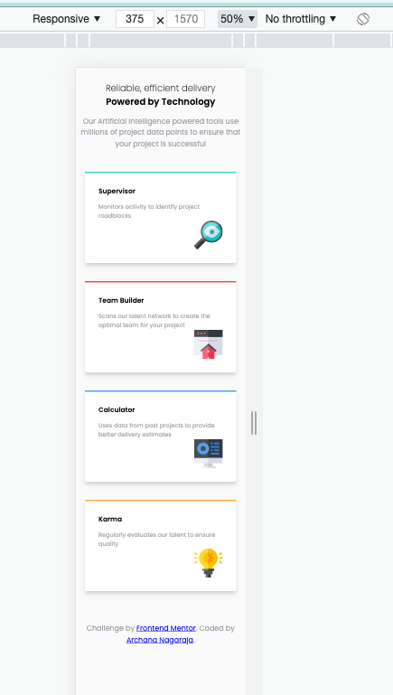
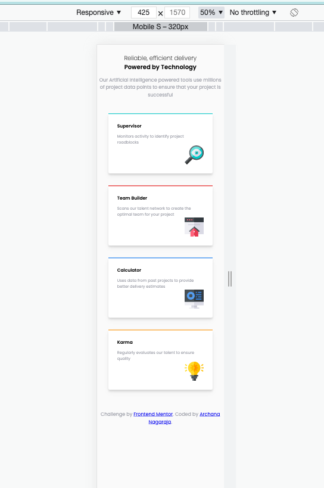
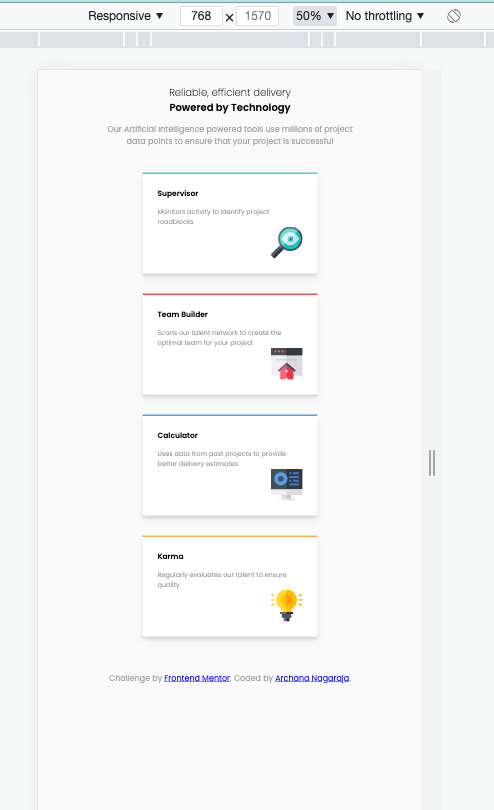
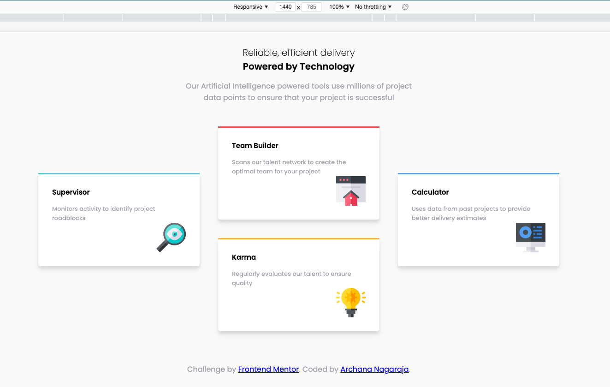

# Frontend Mentor - Four card feature section solution

This is a solution to the [Four card feature section challenge on Frontend Mentor](https://www.frontendmentor.io/challenges/four-card-feature-section-weK1eFYK). Frontend Mentor challenges help you improve your coding skills by building realistic projects.

## Table of contents

- [Overview](#overview)
  - [The challenge](#the-challenge)
  - [Screenshot](#screenshot)
  - [Links](#links)
- [My process](#my-process)
  - [Built with](#built-with)
  - [What I learned](#what-i-learned)
- [Author](#author)

## Overview

### The challenge

Your challenge is to build out this feature section and get it looking as close to the design as possible.

Your users should:

- View the optimal layout for the site depending on their device's screen size

### Screenshot

Screen_Mobile_375  

Screen_Mobile_425  

Screen_Tablet_768  

Screen_Laptop_1024  

### Links

- Solution URL: [Github Repo](https://github.com/archana-nagaraj/Frontend-Mentor-Four-card-feature-section)
- Live Site URL: [Github Pages](https://archana-nagaraj.github.io/Frontend-Mentor-Four-card-feature-section/)

## My process

### Built with

- Semantic HTML5 markup
- CSS custom properties
- Flexbox

### What I learned

- css property transform which transforms the div by 50% on y-axis `transform: translateY(50%);`
- box-shadow codepen resources

## Author

- Frontend Mentor - [@archana-nagaraj](https://www.frontendmentor.io/profile/archana-nagaraj)
- Github - [@archana-nagaraj](https://github.com/archana-nagaraj)
- Email - [archana.nagaraj](archana.nagaraj@gmail.com)

**Had fun building!** 🚀
